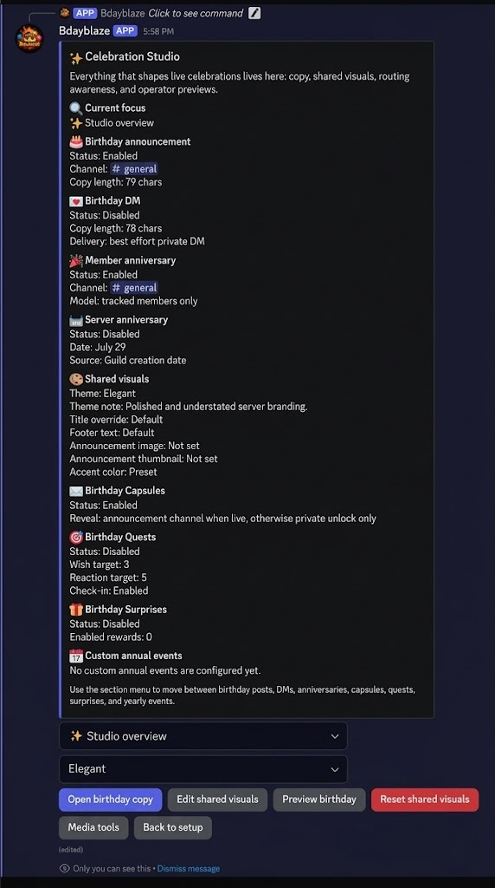
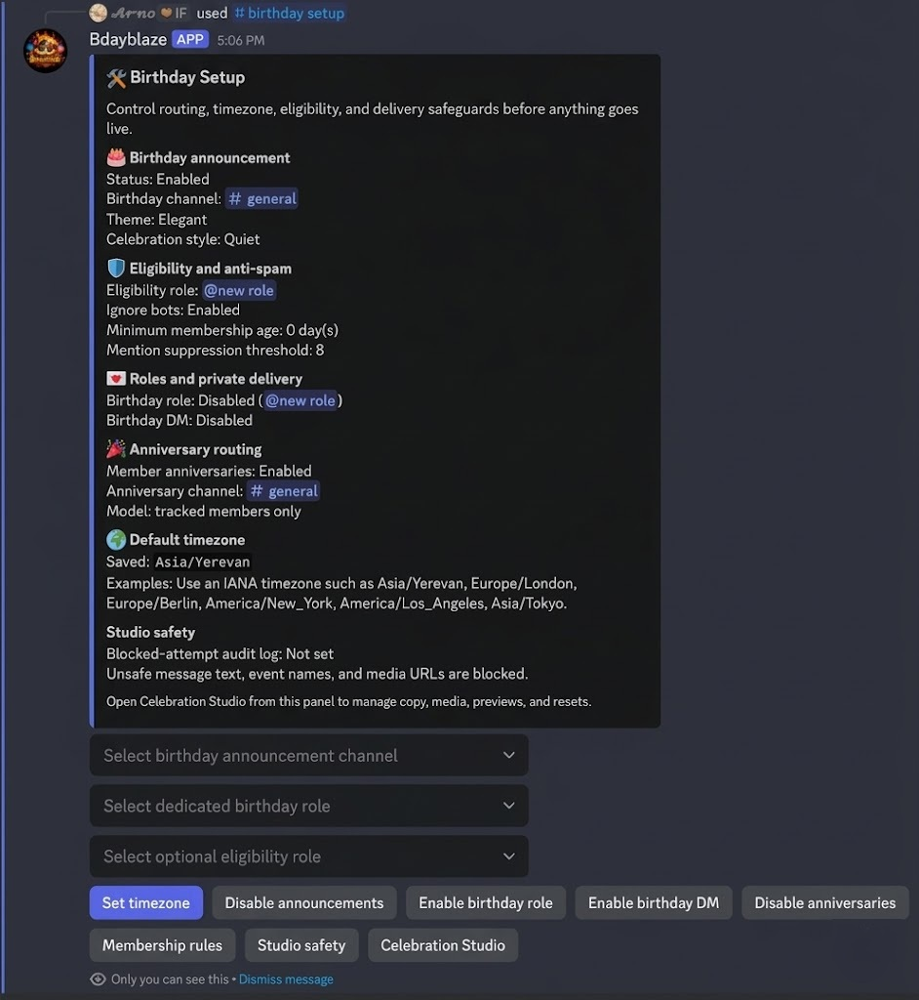

# Bdayblaze

Bdayblaze is a production-minded Discord birthday bot built for polished celebration moments, private admin control, and reliable delivery on lightweight infrastructure.

[Install Bdayblaze](https://discord.com/oauth2/authorize?client_id=1485920716573380660) | [Support server](https://discord.com/servers/inevitable-friendship-1322933864360050688) | [GitHub Pages site](https://arno-create.github.io/Bdayblaze/) | [Repository](https://github.com/arno-create/Bdayblaze)

## Why Bdayblaze

- Birthday Capsules keep wishes private until the birthday window opens.
- Birthday Quests add wish goals, shared-post reaction goals, and optional check-ins without Message Content intent.
- Timeline cards give members a countdown, active celebration state, and compact history.
- Celebration Studio and Birthday Setup keep previews, routing, media checks, and safety controls inside Discord.
- Scheduler recovery, health endpoints, and compact analytics are designed for real deployments, not demo-only flows.

## Product surfaces



Celebration Studio is the main private admin surface for announcements, anniversaries, shared visuals, capsules, quests, surprises, and previews.



Birthday Setup handles channel routing, eligibility, roles, anniversary behavior, timezone defaults, and Studio safety from one operator flow.

## Quick start

1. Create a virtual environment and install dependencies.

   ```bash
   python -m venv .venv
   .venv\Scripts\activate
   pip install -e .[dev]
   ```

2. Copy `.env.example` to `.env` and set:
   - `DISCORD_TOKEN`
   - `DATABASE_URL`

3. Run migrations.

   ```bash
   python -m bdayblaze.main migrate
   ```

4. Start the bot.

   ```bash
   python -m bdayblaze.main run
   ```

## Command surface

Top-level:

- `/help`
- `/about`

Members:

- `/birthday set`, `/birthday view`, `/birthday remove`, `/birthday privacy`
- `/birthday today`, `/birthday next`, `/birthday upcoming`, `/birthday month`, `/birthday twins`, `/birthday list`
- `/birthday timeline`
- `/birthday wish add|list|remove`
- `/birthday capsule preview`
- `/birthday quest status|check-in`

Admins:

- `/birthday studio`, `/birthday setup`, `/birthday test-message`
- `/birthday analytics`, `/birthday health`
- `/birthday surprise queue|fulfill`
- `/birthday member view|set|remove`
- `/birthday anniversary settings|sync`
- `/birthday event add|edit|list|remove`
- `/birthday import`, `/birthday export`

## Deployment notes

- Render should run the bot runtime and health endpoints only.
- The public marketing site is a separate static bundle served from the repository root.
- Canonical static entrypoint: [`index.html`](index.html)
- Canonical static assets: [`styles.css`](styles.css), [`site.js`](site.js), [`.nojekyll`](.nojekyll), and [`assets/`](assets/)
- GitHub Pages should publish `main / (root)` so the landing page plus `privacy/index.html` and `terms/index.html` are served from the same source of truth.

## Privacy and legal

- [Privacy policy](PRIVACY.md)
- [Public privacy page](https://arno-create.github.io/Bdayblaze/privacy/)
- [Terms of Service](TERMS.md)
- [Public Terms of Service page](https://arno-create.github.io/Bdayblaze/terms/)
- [License](LICENSE)
- [Notice](NOTICE)

## More from Arno Create

- [Babblebox](https://arno-create.github.io/babblebox-bot/)
- [X](https://x.com/arno__if)
- [Instagram](https://instagram.com/arno.if)
